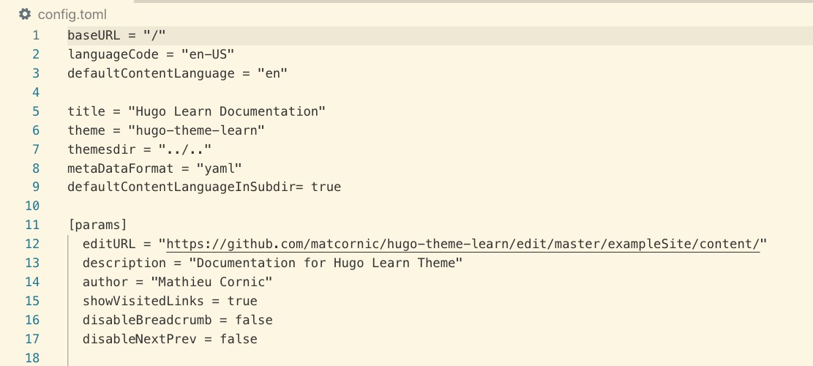
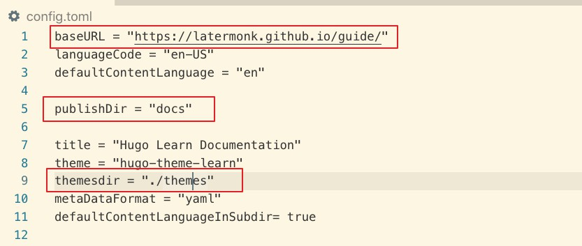

# hugo   

## quick start
https://gohugo.io/getting-started/quick-start/       


##  Host on GitHub
https://gohugo.io/hosting-and-deployment/hosting-on-github/    


#  in action


```
hugo new site  guide
```


```
cd guide
```


```
git init
```


```
git submodule add https://github.com/matcornic/hugo-theme-learn.git themes/hugo-theme-learn
```


```
cp  -rf themes/hugo-theme-learn/exampleSite/*  ./

```


**change config.toml**


```
baseURL = "https://latermonk.github.io/hugo-demo/"
publishDir = "docs"
themesdir = "./themes"
```








```
hugo server -D
```


```
hugo
```

***commit to github***

```
#!/bin/bash
hugo new site  hugo-demo
cd hugo-demo
git init 
git submodule add https://github.com/matcornic/hugo-theme-learn.git themes/hugo-theme-learn
cp  -rf themes/hugo-theme-learn/exampleSite/*  ./


xxx
```


